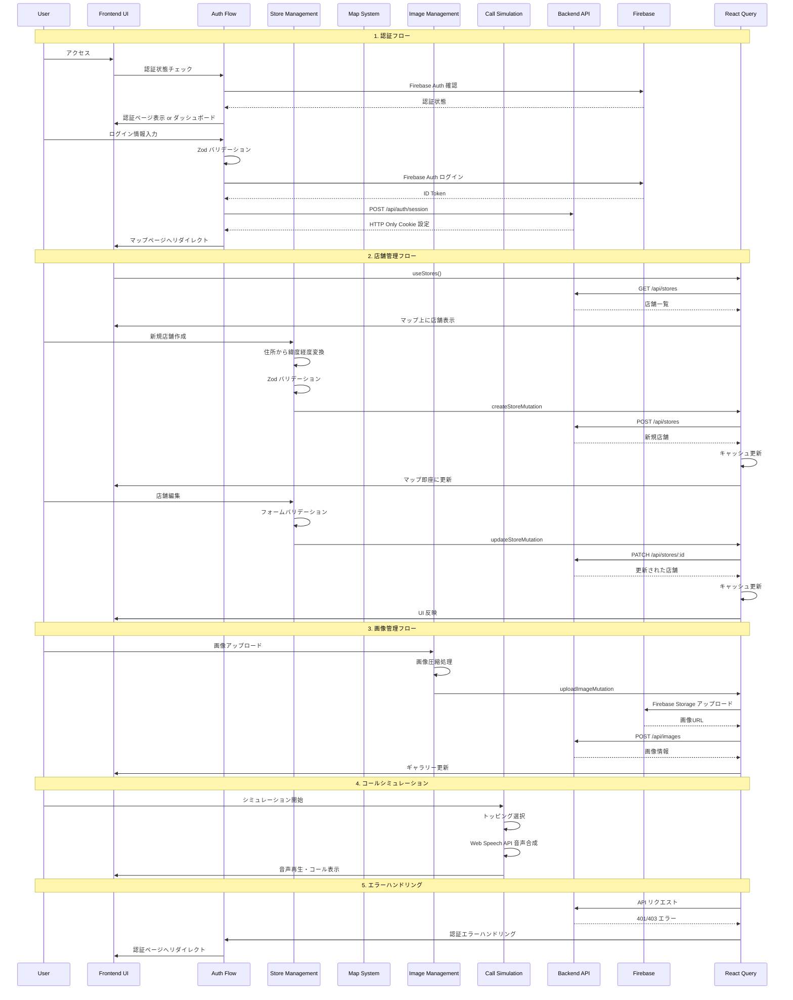

# J.Navi - 二郎系ラーメン店舗情報共有アプリ

<p align="center">
  
  
  
</p>

<p align="center">J.Navi - 二郎系ラーメン専門の店舗情報共有・コールシミュレーションアプリ</p>

## 概要

J.Navi は、二郎系ラーメン愛好家のための専門的な店舗情報共有プラットフォームです。Next.js 15 の App Router と React 19 を使用し、Material UI と Tailwind CSS でスタイリングされています。Google Maps との連携によるインタラクティブな店舗マップ、画像管理機能、そして初心者でも安心して注文できるコールシミュレーション機能を提供し、二郎系ラーメンの文化を広めることを目指しています。

## 機能

### 🔐 認証機能

- **ユーザー登録**: メールアドレスとパスワードによる新規アカウント作成
- **ログイン**: Firebase Authentication によるセキュアな認証
- **セッション管理**: HTTP Only クッキーによる永続的なセッション維持
- **認証ガード**: 未認証ユーザーの自動リダイレクト
- **エラーハンドリング**: 認証エラーの適切な表示と処理

### 🏪 店舗管理機能

- **店舗登録**: 店名、住所、営業時間、定休日などの基本情報を登録
- **店舗編集**: 既存店舗情報の更新・修正
- **店舗削除**: 確認ダイアログ付きの安全な削除
- **住所自動変換**: 住所入力から自動で緯度経度を取得
- **リアルタイム更新**: Optimistic UI による即座の反映

### 🗺️ インタラクティブマップ

- **Google Maps 連携**: @vis.gl/react-google-maps による高機能マップ
- **店舗マーカー表示**: 登録された店舗をマップ上に一覧表示
- **詳細情報表示**: マーカークリックで店舗詳細をドロワー表示
- **位置情報取得**: ユーザーの現在位置から近隣店舗を検索
- **レスポンシブ対応**: モバイル・デスクトップ両対応のマップ表示

### 📸 画像管理機能

- **画像アップロード**: 店舗外観やラーメン画像の複数枚アップロード
- **画像編集**: アップロード済み画像の情報更新
- **画像削除**: 不要な画像の安全な削除
- **ギャラリー表示**: 店舗ごとの画像をギャラリー形式で表示
- **画像圧縮**: アップロード時の自動画像圧縮

### 🎯 コールシミュレーション

- **トッピング選択**: 各店舗のトッピングオプションを登録・管理
- **コール登録**: 注文時のコール（かけ声）を店舗ごとに設定
- **シミュレーション体験**: 実際の注文フローを模擬体験
- **音声合成**: ブラウザの音声合成 API によるコール音声再生
- **段階的学習**: 初心者から上級者まで対応した学習システム

### 👤 ユーザー管理機能

- **プロフィール表示**: ログイン中のユーザー情報表示
- **アカウント管理**: ユーザー情報の確認・更新

### 🛡️ セキュリティ機能

- **入力バリデーション**: Zod による型安全なバリデーション
- **XSS 対策**: DOMPurify による入力サニタイズ
- **認証ガード**: 未認証アクセスの自動リダイレクト
- **エラーハンドリング**: セキュリティエラーの適切な処理
- **型安全性**: TypeScript Strict Mode による実行時エラー削減

## 技術スタック

| カテゴリ               | 技術・ライブラリ                                                                                                                         | バージョン | 用途                                   |
| ---------------------- | ---------------------------------------------------------------------------------------------------------------------------------------- | ---------- | -------------------------------------- |
| **言語**               |  TypeScript     | 5.x        | 型安全性の確保                         |
| **フレームワーク**     |  Next.js                | 15.3.2     | React ベースのフルスタックフレーム     |
| **ライブラリ**         |  React                    | 19.x       | ユーザーインターフェース構築           |
| **UI フレームワーク**  |  Material UI                                                          | 7.1.1      | モダンな UI コンポーネント             |
| **CSS フレームワーク** |  Tailwind CSS | 4.x        | ユーティリティファーストのスタイリング |
| **状態管理**           | Zustand                                                                                                                                  | 5.0.4      | 軽量な状態管理                         |
| **データフェッチング** |  TanStack React Query                                          | 5.76.1     | サーバー状態管理・キャッシュ           |
| **HTTP クライアント**  |  Axios                                                      | 1.9.0      | API 通信                               |
| **フォーム管理**       | React Hook Form                                                                                                                          | 7.56.4     | フォームバリデーション・状態管理       |
| **バリデーション**     | Zod                                                                                                                                      | 3.25.7     | スキーマバリデーション                 |
| **認証・ストレージ**   |  Firebase              | 11.8.1     | 認証・ファイルストレージ               |
| **マップ**             | @vis.gl/react-google-maps                                                                                                                | 1.5.2      | Google Maps 連携                       |
| **音声合成**           | Web Speech API                                                                                                                           | -          | ブラウザ音声合成                       |

## ページ構成

- **`/auth/login`**: ログインページ
- **`/auth/signup`**: 新規登録ページ
- **`/stores/map`**: 店舗マップページ（メイン）
- **`/stores/create`**: 店舗登録ページ
- **`/stores/[id]/edit`**: 店舗編集ページ
- **`/stores/images/upload/[id]`**: 画像アップロードページ
- **`/stores/images/[id]/edit/[imageId]`**: 画像編集ページ
- **`/stores/simulation/*`**: コールシミュレーションページ群

## 処理フロー



## コンポーネント構成

```mermaid
graph TB
    subgraph "Pages"
        AUTH[🔐 /auth]
        MAP[🗺️ /stores/map]
        CREATE[➕ /stores/create]
        EDIT[✏️ /stores/edit]
        IMAGES[📸 /stores/images]
        SIM[🎯 /simulation]
    end

    subgraph "Layout"
        LAYOUT[📐 RootLayout]
        HEADER[📋 Header]
        DRAWER[📱 StoreInfoDrawer]
    end

    subgraph "Auth Components"
        AUTH_FORM[📝 AuthForm]
        AUTH_INPUT[📝 AuthFormInputText]
        AUTH_SOCIAL[🔗 AuthSocialButtons]
    end

    subgraph "Store Components"
        STORE_FORM[📝 StoreForm]
        STORE_MAP[🗺️ StoreMap]
        STORE_DETAILS[📋 StoreDetailsSection]
        STORE_ACTIONS[⚡ StoreCloseActionsPanel]
    end

    subgraph "Image Components"
        IMAGE_FORM[📸 StoreImageForm]
        IMAGE_GALLERY[🖼️ StoreImageGallery]
        IMAGE_MODAL[🖼️ StoreImageModal]
    end

    subgraph "Simulation Components"
        CALL_RESULT[📊 CallResultScreen]
        SHOP_AUTO[🏪 ShopAutoComplete]
        TICKET_LIST[🎫 TicketCardList]
        TOPPING_SELECT[🎯 ToppingOptionSelector]
    end

    subgraph "Hooks"
        QUERY_STORES[🔄 useStores]
        QUERY_IMAGES[🖼️ useImages]
        MUTATE_STORE[✏️ useCreateStore]
        MUTATE_IMAGE[📸 useUploadImage]
    end

    subgraph "Store & Utils"
        AUTH_STORE[🔐 AuthStore]
        NOTIFICATION[🔔 NotificationController]
        SPEECH[🎤 useSpeechSynthesis]
    end

    AUTH --> AUTH_FORM
    MAP --> STORE_MAP
    CREATE --> STORE_FORM
    EDIT --> STORE_FORM
    IMAGES --> IMAGE_FORM

    LAYOUT --> HEADER
    STORE_MAP --> DRAWER
    DRAWER --> STORE_DETAILS
    DRAWER --> STORE_ACTIONS

    STORE_FORM --> MUTATE_STORE
    STORE_MAP --> QUERY_STORES
    IMAGE_FORM --> MUTATE_IMAGE
    IMAGE_GALLERY --> QUERY_IMAGES

    SIM --> CALL_RESULT
    SIM --> SHOP_AUTO
    SIM --> TICKET_LIST
    SIM --> TOPPING_SELECT

    AUTH_FORM --> AUTH_STORE
    MUTATE_STORE --> NOTIFICATION
    TOPPING_SELECT --> SPEECH
```



## 環境構築手順

### 前提条件

- Node.js (v18 以上)
- npm / yarn / pnpm
- Firebase プロジェクトの設定

### 1. プロジェクトセットアップ

```bash
# リポジトリをクローン
git clone https://github.com/hideaki1979/jnavi_web.git
cd jnavi_web

# 依存関係のインストール
npm install
```

### 2. 環境変数設定

`.env.local` ファイルを作成し、以下の設定を追加：

```bash
# Firebase 設定
NEXT_PUBLIC_FIREBASE_API_KEY=your_firebase_api_key
NEXT_PUBLIC_FIREBASE_AUTH_DOMAIN=your_project.firebaseapp.com
NEXT_PUBLIC_FIREBASE_PROJECT_ID=your_project_id
NEXT_PUBLIC_FIREBASE_STORAGE_BUCKET=your_project.appspot.com
NEXT_PUBLIC_FIREBASE_MESSAGING_SENDER_ID=your_sender_id
NEXT_PUBLIC_FIREBASE_APP_ID=your_app_id

# Firebase Admin SDK
FIREBASE_ADMIN_PROJECT_ID=your_project_id
FIREBASE_ADMIN_PRIVATE_KEY=your_private_key
FIREBASE_ADMIN_CLIENT_EMAIL=your_client_email

# Google Maps API
NEXT_PUBLIC_GOOGLE_MAPS_API_KEY=your_google_maps_api_key
NEXT_PUBLIC_GOOGLE_MAPS_MAP_ID=your_map_id
```

### 3. アプリケーション起動

```bash
# 開発サーバー起動
npm run dev

# 本番ビルド
npm run build
npm start
```

### 4. アクセス確認

ブラウザで [http://localhost:3000](http://localhost:3000) にアクセスしてください。

## 開発コマンド

```bash
# 開発サーバー起動
npm run dev

# 本番ビルド
npm run build

# 本番サーバー起動
npm start

# リンター実行
npm run lint
```

## ディレクトリ構造

```
src/
├── app/                    # Next.js App Router
│   ├── api/               # API ルート
│   │   ├── auth/          # 認証関連 API
│   │   ├── images.ts      # 画像管理 API
│   │   ├── stores.ts      # 店舗管理 API
│   │   └── toppingCalls.ts # トッピングコール API
│   ├── auth/              # 認証ページ
│   ├── stores/            # 店舗管理ページ
│   │   ├── map/           # マップページ
│   │   ├── create/        # 店舗作成ページ
│   │   ├── [id]/edit/     # 店舗編集ページ
│   │   └── images/        # 画像管理ページ
│   ├── simulation/        # コールシミュレーション
│   ├── globals.css        # グローバルスタイル
│   └── layout.tsx         # ルートレイアウト
├── components/            # UI コンポーネント
│   ├── auth/              # 認証関連コンポーネント
│   ├── Store/             # 店舗関連コンポーネント
│   ├── image/             # 画像関連コンポーネント
│   ├── simulation/        # シミュレーション関連コンポーネント
│   ├── modals/            # モーダル・ダイアログ
│   └── layout/            # レイアウトコンポーネント
├── hooks/                 # カスタムフック
│   ├── api/               # API 関連フック
│   ├── useStoreForm.ts    # 店舗フォームフック
│   ├── useImageForm.ts    # 画像フォームフック
│   ├── useResponsive.ts   # レスポンシブフック
│   └── useSpeechSynthesis.ts # 音声合成フック
├── lib/                   # ライブラリ設定
│   ├── server/            # サーバーサイド専用
│   ├── firebase.ts        # Firebase 設定
│   ├── auth.ts            # 認証ユーティリティ
│   └── notification.ts    # 通知システム
├── types/                 # 型定義
│   ├── Store.ts           # 店舗関連型
│   ├── Image.ts           # 画像関連型
│   ├── ToppingCall.ts     # トッピングコール型
│   └── firebase.ts        # Firebase 関連型
├── validations/           # Zod バリデーション
│   ├── store.ts           # 店舗バリデーション
│   ├── image.ts           # 画像バリデーション
│   └── auth.ts            # 認証バリデーション
└── utils/                 # ユーティリティ
    ├── firebaseErrorMessages.ts # Firebase エラーメッセージ
    ├── storeUtils.ts      # 店舗関連ユーティリティ
    └── toppingFormatter.ts # トッピングフォーマッター
```

## セキュリティ機能

- 🛡️ **型安全性**: TypeScript Strict Mode による実行時エラー削減
- ✅ **入力バリデーション**: Zod による型安全なバリデーション
- 🔐 **認証ガード**: Firebase Authentication + HTTP Only Cookie
- 🚫 **XSS 対策**: DOMPurify による入力サニタイズ
- 📝 **エラーハンドリング**: セキュリティエラーの適切な処理
- 🔒 **セッション管理**: セキュアなセッションクッキー

## パフォーマンス最適化

- ⚡ **App Router**: Next.js 15 の最新機能活用
- 🔄 **React Query**: インテリジェントなキャッシング
- 🎯 **Optimistic Updates**: UI の即座な反映
- 📦 **コード分割**: 動的インポートによる遅延読み込み
- 🖼️ **画像最適化**: 自動圧縮・WebP フォーマット
- 🗺️ **マップ最適化**: 条件付きレンダリング・クラスタリング

## ライセンス

このプロジェクトは **MIT ライセンス** の下で公開されています。

## デモサイト

🌐 **本番環境**: https://jnavi-web.vercel.app/stores/map

※ホスティングサービス（Vercel）が不安定なため、一時的にアクセスできない場合があります。
