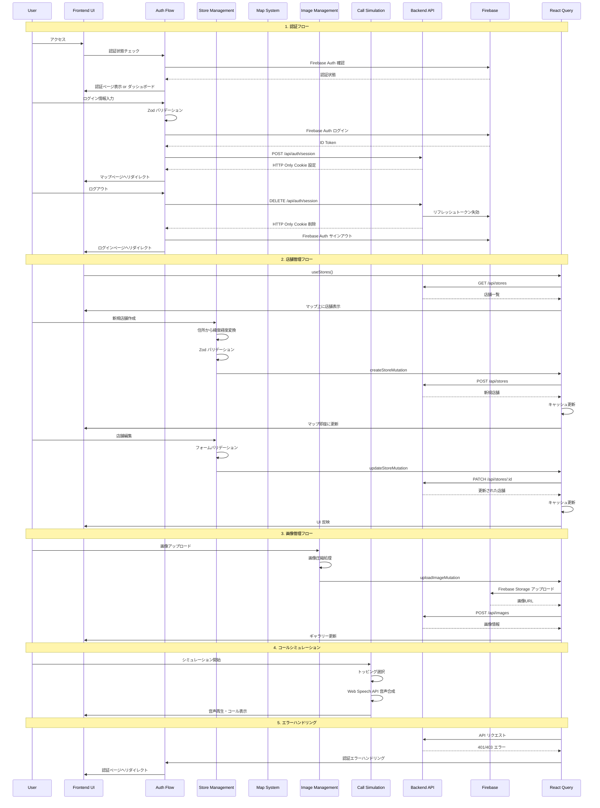

# J.Navi - 二郎系ラーメン店舗情報共有アプリ

<p align="center">
  
  
  
</p>

<p align="center">J.Navi - 二郎系ラーメン専門の店舗情報共有・コールシミュレーションアプリ</p>

## 概要

J.Navi は、二郎系ラーメン愛好家のための専門的な店舗情報共有プラットフォームです。Next.js 15 の App Router と React 19 を使用し、Material UI と Tailwind CSS でスタイリングされています。Google Maps との連携によるインタラクティブな店舗マップ、画像管理機能、そして初心者でも安心して注文できるコールシミュレーション機能を提供し、二郎系ラーメンの文化を広めることを目指しています。

## 機能

### 🔐 認証機能

- **ユーザー登録**: メールアドレスとパスワードによる新規アカウント作成
- **ログイン**: Firebase Authentication によるセキュアな認証
- **セッション管理**: HTTP Only クッキーによる永続的なセッション維持
- **ログアウト**: セッションクッキーの削除とリフレッシュトークンの失効による確実なサインアウト
- **認証ガード**: 未認証ユーザーの自動リダイレクト
- **エラーハンドリング**: 認証エラーの適切な表示と処理

### 🏪 店舗管理機能

- **店舗登録**: 店名、住所、営業時間、定休日などの基本情報を登録
- **店舗編集**: 既存店舗情報の更新・修正
- **店舗削除**: 確認ダイアログ付きの安全な削除
- **住所自動変換**: 住所入力から自動で緯度経度を取得
- **リアルタイム更新**: Optimistic UI による即座の反映

### 🗺️ インタラクティブマップ

- **Google Maps 連携**: @vis.gl/react-google-maps による高機能マップ
- **店舗マーカー表示**: 登録された店舗をマップ上に一覧表示
- **詳細情報表示**: マーカークリックで店舗詳細をドロワー表示
- **位置情報取得**: ユーザーの現在位置から近隣店舗を検索
- **レスポンシブ対応**: モバイル・デスクトップ両対応のマップ表示

### 📸 画像管理機能

- **画像アップロード**: 店舗外観やラーメン画像の複数枚アップロード
- **画像編集**: アップロード済み画像の情報更新
- **画像削除**: 不要な画像の安全な削除
- **ギャラリー表示**: 店舗ごとの画像をギャラリー形式で表示
- **画像圧縮**: アップロード時の自動画像圧縮

### 🎯 コールシミュレーション

- **トッピング選択**: 各店舗のトッピングオプションを登録・管理
- **コール登録**: 注文時のコール（かけ声）を店舗ごとに設定
- **シミュレーション体験**: 実際の注文フローを模擬体験
- **音声合成**: ブラウザの音声合成 API によるコール音声再生
- **段階的学習**: 初心者から上級者まで対応した学習システム

### 👤 ユーザー管理機能

- **プロフィール表示**: ログイン中のユーザー情報表示
- **アカウント管理**: ユーザー情報の確認・更新

### 🛡️ セキュリティ機能

- **入力バリデーション**: Zod による型安全なバリデーション
- **XSS 対策**: DOMPurify による入力サニタイズ
- **認証ガード**: 未認証アクセスの自動リダイレクト
- **エラーハンドリング**: セキュリティエラーの適切な処理
- **型安全性**: TypeScript Strict Mode による実行時エラー削減

## 技術スタック

| カテゴリ               | 技術・ライブラリ                                                                                                                         | バージョン | 用途                                   |
| ---------------------- | ---------------------------------------------------------------------------------------------------------------------------------------- | ---------- | -------------------------------------- |
| **言語**               |  TypeScript     | 5.x        | 型安全性の確保                         |
| **フレームワーク**     |  Next.js                | 15.3.2     | React ベースのフルスタックフレーム     |
| **ライブラリ**         |  React                    | 19.x       | ユーザーインターフェース構築           |
| **UI フレームワーク**  |  Material UI                                                          | 7.1.1      | モダンな UI コンポーネント             |
| **CSS フレームワーク** |  Tailwind CSS | 4.x        | ユーティリティファーストのスタイリング |
| **状態管理**           | Zustand                                                                                                                                  | 5.0.4      | 軽量な状態管理                         |
| **データフェッチング** |  TanStack React Query                                          | 5.76.1     | サーバー状態管理・キャッシュ           |
| **HTTP クライアント**  |  Axios                                                      | 1.9.0      | API 通信                               |
| **フォーム管理**       | React Hook Form                                                                                                                          | 7.56.4     | フォームバリデーション・状態管理       |
| **バリデーション**     | Zod                                                                                                                                      | 3.25.7     | スキーマバリデーション                 |
| **認証・ストレージ**   |  Firebase              | 11.8.1     | 認証・ファイルストレージ               |
| **マップ**             | @vis.gl/react-google-maps                                                                                                                | 1.5.2      | Google Maps 連携                       |
| **音声合成**           | Web Speech API                                                                                                                           | -          | ブラウザ音声合成                       |

## ページ構成

- **`/auth/login`**: ログインページ
- **`/auth/signup`**: 新規登録ページ
- **`/stores/map`**: 店舗マップページ（メイン）
- **`/stores/create`**: 店舗登録ページ
- **`/stores/[id]/edit`**: 店舗編集ページ
- **`/stores/images/upload/[id]`**: 画像アップロードページ
- **`/stores/images/[id]/edit/[imageId]`**: 画像編集ページ
- **`/stores/simulation/*`**: コールシミュレーションページ群

## 処理フロー


```mermaid
sequenceDiagram
    participant U as User
    participant UI as Frontend UI
    participant A as Auth Flow
    participant S as Store Management
    participant M as Map System
    participant I as Image Management
    participant C as Call Simulation
    participant API as Backend API
    participant F as Firebase
    participant RQ as React Query

    Note over U,RQ: 1. 認証フロー
    U->>UI: アクセス
    UI->>A: 認証状態チェック
    A->>F: Firebase Auth 確認
    F-->>A: 認証状態
    A->>UI: 認証ページ表示 or ダッシュボード

    U->>A: ログイン情報入力
    A->>A: Zod バリデーション
    A->>F: Firebase Auth ログイン
    F-->>A: ID Token
    A->>API: POST /api/auth/session
    API-->>A: HTTP Only Cookie 設定
    A->>UI: マップページへリダイレクト

    U->>A: ログアウト
    A->>API: DELETE /api/auth/session
    API->>F: リフレッシュトークン失効
    API-->>A: HTTP Only Cookie 削除
    A->>F: Firebase Auth サインアウト
    A->>UI: ログインページへリダイレクト

    Note over U,RQ: 2. 店舗管理フロー
    UI->>RQ: useStores()
    RQ->>API: GET /api/stores
    API-->>RQ: 店舗一覧
    RQ->>UI: マップ上に店舗表示

    U->>S: 新規店舗作成
    S->>S: 住所から緯度経度変換
    S->>S: Zod バリデーション
    S->>RQ: createStoreMutation
    RQ->>API: POST /api/stores
    API-->>RQ: 新規店舗
    RQ->>RQ: キャッシュ更新
    RQ->>UI: マップ即座に更新

    U->>S: 店舗編集
    S->>S: フォームバリデーション
    S->>RQ: updateStoreMutation
    RQ->>API: PATCH /api/stores/:id
    API-->>RQ: 更新された店舗
    RQ->>RQ: キャッシュ更新
    RQ->>UI: UI 反映

    Note over U,RQ: 3. 画像管理フロー
    U->>I: 画像アップロード
    I->>I: 画像圧縮処理
    I->>RQ: uploadImageMutation
    RQ->>F: Firebase Storage アップロード
    F-->>RQ: 画像URL
    RQ->>API: POST /api/images
    API-->>RQ: 画像情報
    RQ->>UI: ギャラリー更新

    Note over U,RQ: 4. コールシミュレーション
    U->>C: シミュレーション開始
    C->>C: トッピング選択
    C->>C: Web Speech API 音声合成
    C->>UI: 音声再生・コール表示

    Note over U,RQ: 5. エラーハンドリング
    RQ->>API: API リクエスト
    API-->>RQ: 401/403 エラー
    RQ->>A: 認証エラーハンドリング
    A->>UI: 認証ページへリダイレクト
```

## コンポーネント構成


```mermaid
graph TB
    subgraph "Pages"
        AUTH[🔐 /auth]
        MAP[🗺️ /stores/map]
        CREATE[➕ /stores/create]
        EDIT[✏️ /stores/edit]
        IMAGES[📸 /stores/images]
        SIM[🎯 /simulation]
    end

    subgraph "Layout"
        LAYOUT[📐 RootLayout]
        HEADER[📋 Header]
        DRAWER[📱 StoreInfoDrawer]
    end

    subgraph "Auth Components"
        AUTH_FORM[📝 AuthForm]
        AUTH_INPUT[📝 AuthFormInputText]
        AUTH_SOCIAL[🔗 AuthSocialButtons]
    end

    subgraph "Store Components"
        STORE_FORM[📝 StoreForm]
        STORE_MAP[🗺️ StoreMap]
        STORE_DETAILS[📋 StoreDetailsSection]
        STORE_ACTIONS[⚡ StoreCloseActionsPanel]
    end

    subgraph "Image Components"
        IMAGE_FORM[📸 StoreImageForm]
        IMAGE_GALLERY[🖼️ StoreImageGallery]
        IMAGE_MODAL[🖼️ StoreImageModal]
    end

    subgraph "Simulation Components"
        CALL_RESULT[📊 CallResultScreen]
        SHOP_AUTO[🏪 ShopAutoComplete]
        TICKET_LIST[🎫 TicketCardList]
        TOPPING_SELECT[🎯 ToppingOptionSelector]
    end

    subgraph "Hooks"
        QUERY_STORES[🔄 useStores]
        QUERY_IMAGES[🖼️ useImages]
        MUTATE_STORE[✏️ useCreateStore]
        MUTATE_IMAGE[📸 useUploadImage]
    end

    subgraph "Store & Utils"
        AUTH_STORE[🔐 AuthStore]
        NOTIFICATION[🔔 NotificationController]
        SPEECH[🎤 useSpeechSynthesis]
    end

    AUTH --> AUTH_FORM
    MAP --> STORE_MAP
    CREATE --> STORE_FORM
    EDIT --> STORE_FORM
    IMAGES --> IMAGE_FORM

    LAYOUT --> HEADER
    STORE_MAP --> DRAWER
    DRAWER --> STORE_DETAILS
    DRAWER --> STORE_ACTIONS

    STORE_FORM --> MUTATE_STORE
    STORE_MAP --> QUERY_STORES
    IMAGE_FORM --> MUTATE_IMAGE
    IMAGE_GALLERY --> QUERY_IMAGES

    SIM --> CALL_RESULT
    SIM --> SHOP_AUTO
    SIM --> TICKET_LIST
    SIM --> TOPPING_SELECT

    AUTH_FORM --> AUTH_STORE
    MUTATE_STORE --> NOTIFICATION
    TOPPING_SELECT --> SPEECH
```

## 環境構築手順

### 前提条件

- Node.js (v22 以上 / firebase-admin 14 系の要件。Next.js 16 自体の要件は v20.9 以上)
  - リポジトリ直下の `.nvmrc` は `24` を指定しています。`nvm use` で切り替えられます
  - `package.json` の `engines.node` は `>=22`
- npm / yarn / pnpm
- Firebase プロジェクトの設定

### 1. プロジェクトセットアップ

```bash
# リポジトリをクローン
git clone https://github.com/hideaki1979/jnavi_web.git
cd jnavi_web

# 依存関係のインストール
npm install
```

### 2. 環境変数設定

`.env.local` ファイルを作成し、以下の設定を追加：

```bash
# バックエンド API URL（開発環境の場合）
NEXT_PUBLIC_API_URL=http://localhost:8000

# Google Maps API 設定
NEXT_PUBLIC_GOOGLE_MAPS_API_KEY=your_google_maps_api_key
# Google Maps JavaScript API の API キー
# Google Cloud Console で Maps JavaScript API を有効化して取得

NEXT_PUBLIC_GOOGLE_MAPS_ID=your_map_id
# Google Maps のカスタムマップ ID
# Google Cloud Console で Map ID を作成して取得

# Firebase クライアント設定（フロントエンド用）
NEXT_PUBLIC_FIREBASE_API_KEY=your_firebase_api_key
# Firebase プロジェクトの Web API キー
# Firebase Console > プロジェクト設定 > 全般 > Web API キー

NEXT_PUBLIC_FIREBASE_AUTH_DOMAIN=your_project.firebaseapp.com
# Firebase プロジェクトの認証ドメイン
# 例: my-project-12345.firebaseapp.com

NEXT_PUBLIC_FIREBASE_PROJECT_ID=your_project_id
# Firebase プロジェクト ID
# Firebase Console > プロジェクト設定 > 全般 > プロジェクト ID

NEXT_PUBLIC_FIREBASE_MESSAGING_SENDER_ID=your_sender_id
# Firebase Cloud Messaging の送信者 ID
# Firebase Console > プロジェクト設定 > クラウドメッセージング > 送信者 ID

NEXT_PUBLIC_FIREBASE_APP_ID=your_app_id
# Firebase アプリの ID
# Firebase Console > プロジェクト設定 > 全般 > アプリ ID

# Firebase Admin SDK 設定（サーバーサイド用）
FIREBASE_PROJECT_ID=your_project_id
# Firebase プロジェクト ID（サーバーサイド用）
# Firebase Console > プロジェクト設定 > 全般 > プロジェクト ID

FIREBASE_CLIENT_EMAIL=your_client_email
# Firebase Admin SDK のサービスアカウントメールアドレス
# Firebase Console > プロジェクト設定 > サービスアカウント > 新しい秘密鍵の生成

FIREBASE_PRIVATE_KEY=your_private_key
# Firebase Admin SDK の秘密鍵
# Firebase Console > プロジェクト設定 > サービスアカウント > 新しい秘密鍵の生成
# 注意: 改行文字（\n）を含むため、文字列として適切にエスケープする必要があります
```

### 3. アプリケーション起動

```bash
# 開発サーバー起動
npm run dev

# 本番ビルド
npm run build
npm start
```

### 4. アクセス確認

ブラウザで [http://localhost:3000](http://localhost:3000) にアクセスしてください。

## 開発コマンド

```bash
# 開発サーバー起動
npm run dev

# 本番ビルド
npm run build

# 本番サーバー起動
npm start

# リンター実行（中身は eslint。Next.js 16 で `next lint` は削除された）
npm run lint

# 型チェック
npx tsc --noEmit

# スモークテスト（dev と本番ビルドの両構成を順に実行）
npm run test:e2e
```

> Next.js 16 では `next build` が lint を実行しなくなりました。
> ビルドが通っても lint エラーは検出されないため、`npm run lint` を明示的に実行してください。

## スモークテスト（Playwright）

主要ページが開いて、コンソールにエラーが出ないことを機械的に確認するテストです。
E2E の網羅ではなく、**Next.js / React / MUI のような描画の根幹に関わる依存を更新したときに、
ビルドと型チェックが通っても実行時に壊れていないか**を確かめるのが目的です。

### 前提：バックエンドを起動しておくこと

このテストは**実バックエンド（nodedeploytest）に対して実行します。**
実行前に、バックエンドと PostgreSQL（docker-compose の `jnavi-postgres` / `localhost:5433`）を
起動しておいてください。Docker が落ちているとバックエンドのプロセスが生きていても
API は全て 500 を返します。

接続先は `.env` の `NEXT_PUBLIC_API_URL` がそのまま使われます（既定 `http://localhost:3000`）。
バックエンドに接続できない場合は、テスト開始前に案内を出して停止します。

### 実行方法

初回のみ、Playwright が使うブラウザを取得します。

```bash
npx playwright install chromium
```

```bash
# dev（Turbopack）構成で実行
npm run test:e2e:dev

# 本番ビルド（next build + next start）構成で実行
npm run test:e2e:prod

# 両構成を順に実行
npm run test:e2e

# 直近の実行結果を HTML レポートで見る（スクリーンショット付き）
npm run test:e2e:report
```

**dev と本番ビルドは別実装なので、両方で回してください。** 片方だけでは不十分です。
実際に dev では素通りする hydration 不一致が、本番ビルドでのみ
`Minified React error #418` として現れるケースがあります（逆も同様）。

Next.js サーバーは Playwright が自動で起動・停止するため、
事前に `npm run dev` を立ち上げておく必要はありません。
使用ポートは dev が `3100`、本番ビルドが `3200` です（`E2E_APP_PORT` で変更可能）。
`:3000` はバックエンドが占有しているため使いません。

### バックエンド無しで回す（スタブAPI）

バックエンドや DB を用意できない場合は、スタブ API に切り替えられます。
依存が Node だけになるので、将来 CI に載せるならこちらを使います。

```bash
# 両構成をスタブAPIで実行
npm run test:e2e:mock

# 個別に切り替える場合
E2E_USE_MOCK_API=1 npm run test:e2e:dev
```

スタブは `e2e/mock-api/server.mjs`（既定ポート `3300`、`E2E_MOCK_API_PORT` で変更可能）で、
返す固定データは `e2e/mock-api/fixtures.mjs` にあります。
**スタブが実バックエンドに追随しているかは自動では検証されません。**
レスポンス形が変わったときにスタブが古いままだと、スタブ経由のテストだけが通り続けます。
日常の確認は実バックエンドで回すことを前提にしてください。

なお、このアプリはバックエンド API をブラウザから直接叩かず、
読み取りはサーバーコンポーネント、書き込みは Server Action が呼びます。
通信は「Next.js サーバー → バックエンド」の Node 間で完結するため、
ブラウザ側で網を張る Playwright の `page.route()` では差し替えられません。
スタブをプロセスとして別に立てているのはこのためです。

### 何を検出するか

| 種別 | 扱い |
| --- | --- |
| hydration 不一致 | 常に失敗。許容リストの対象外 |
| `console.error` / `console.warn` | 許容リストに無ければ失敗 |
| 未捕捉例外（`pageerror`） | 許容リストに無ければ失敗 |
| HTTP ステータス 400 以上 | 失敗。真っ白なエラーページを見逃さないため |

許容リストは `e2e/console-guard.ts` の `IGNORE_RULES` にあります。
**追加するときは必ず理由をコメントで書いてください。**
広いパターンを置くと、検出したい退行まで一緒に隠れます。
許容したものは黙って捨てず、テストレポートに理由つきで添付されます。

本番ビルドのテストが落ちたときは、まず `npm run test:e2e:dev` で同じルートを開いてください。
本番ビルドではメッセージが `Minified React error #NNN` に置き換わり内容が読めませんが、
dev では実メッセージが読めます。

### 対象ルート

対象は認証なしで開ける公開ルートのみです（`e2e/routes.ts`）。
`src/proxy.ts` の matcher 対象（`/stores/create`、`/stores/{id}/edit`、
`/stores/images/{id}/upload`、`/stores/images/{id}/edit/{imageId}`）は
セッション Cookie が無いとログイン画面へリダイレクトされるため含めていません。
カバーするには `storageState` によるログイン状態の使い回しとテスト用 Firebase アカウントが必要です。

店舗 ID を必要とするルート（事前コール・着丼前コール）で使う ID は、
`e2e/global-setup.ts` が `GET /stores` の先頭の店舗から取得します。
ID を決め打ちにすると、DB の中身が違う環境で
「API が 404 を返す状態」を検証することになってしまうためです。

## ディレクトリ構造

```
src/
├── app/                    # Next.js App Router
│   ├── api/               # API ルート
│   │   ├── auth/          # 認証関連 API
│   │   ├── images.ts      # 画像管理 API
│   │   ├── stores.ts      # 店舗管理 API
│   │   └── toppingCalls.ts # トッピングコール API
│   ├── auth/              # 認証ページ
│   ├── stores/            # 店舗管理ページ
│   │   ├── map/           # マップページ
│   │   ├── create/        # 店舗作成ページ
│   │   ├── [id]/edit/     # 店舗編集ページ
│   │   └── images/        # 画像管理ページ
│   ├── simulation/        # コールシミュレーション
│   ├── globals.css        # グローバルスタイル
│   └── layout.tsx         # ルートレイアウト
├── components/            # UI コンポーネント
│   ├── auth/              # 認証関連コンポーネント
│   ├── Store/             # 店舗関連コンポーネント
│   ├── image/             # 画像関連コンポーネント
│   ├── simulation/        # シミュレーション関連コンポーネント
│   ├── modals/            # モーダル・ダイアログ
│   └── layout/            # レイアウトコンポーネント
├── hooks/                 # カスタムフック
│   ├── api/               # API 関連フック
│   ├── useStoreForm.ts    # 店舗フォームフック
│   ├── useImageForm.ts    # 画像フォームフック
│   ├── useResponsive.ts   # レスポンシブフック
│   └── useSpeechSynthesis.ts # 音声合成フック
├── lib/                   # ライブラリ設定
│   ├── server/            # サーバーサイド専用
│   ├── firebase.ts        # Firebase 設定
│   ├── auth.ts            # 認証ユーティリティ
│   └── notification.ts    # 通知システム
├── types/                 # 型定義
│   ├── Store.ts           # 店舗関連型
│   ├── Image.ts           # 画像関連型
│   ├── ToppingCall.ts     # トッピングコール型
│   └── firebase.ts        # Firebase 関連型
├── validations/           # Zod バリデーション
│   ├── store.ts           # 店舗バリデーション
│   ├── image.ts           # 画像バリデーション
│   └── auth.ts            # 認証バリデーション
└── utils/                 # ユーティリティ
    ├── firebaseErrorMessages.ts # Firebase エラーメッセージ
    ├── storeUtils.ts      # 店舗関連ユーティリティ
    └── toppingFormatter.ts # トッピングフォーマッター

e2e/                       # Playwright スモークテスト
├── mock-api/              # スタブバックエンド API（E2E_USE_MOCK_API=1 のときのみ）
│   ├── server.mjs         # スタブサーバー本体
│   └── fixtures.mjs       # スタブが返す固定データ
├── console-guard.ts       # コンソール出力の収集・判定・許容リスト
├── global-setup.ts        # 実在する店舗IDの取得
├── require-backend.mjs    # バックエンド未起動時に案内を出して停止
├── routes.ts              # 対象ルート定義
└── smoke.spec.ts          # テスト本体
```

## セキュリティ機能

- 🛡️ **型安全性**: TypeScript Strict Mode による実行時エラー削減
- ✅ **入力バリデーション**: Zod による型安全なバリデーション
- 🔐 **認証ガード**: Firebase Authentication + HTTP Only Cookie
- 🚫 **XSS 対策**: DOMPurify による入力サニタイズ
- 📝 **エラーハンドリング**: セキュリティエラーの適切な処理
- 🔒 **セッション管理**: セキュアなセッションクッキー

## パフォーマンス最適化

- ⚡ **App Router**: Next.js 15 の最新機能活用
- 🔄 **React Query**: インテリジェントなキャッシング
- 🎯 **Optimistic Updates**: UI の即座な反映
- 📦 **コード分割**: 動的インポートによる遅延読み込み
- 🖼️ **画像最適化**: 自動圧縮・WebP フォーマット
- 🗺️ **マップ最適化**: 条件付きレンダリング・クラスタリング

### コード規約・重要実装ポイント

- **TypeScript Strict Mode**: 型安全性を重視し、`any`型の使用を原則禁止します。
- **コンポーネント設計**:
  - 200 行を超えるコンポーネントは機能ごとに分割します。
  - 3 箇所以上で使用されるロジックはカスタムフックに抽出し、共通化します。
- **状態管理**:
  - サーバー状態は TanStack React Query、クライアント状態は Zustand で管理します。
  - API フックは`src/hooks/api`に集約します。
- **フォーム**: React Hook Form と Zod を組み合わせ、型安全で再利用性の高いフォームを構築します。
- **認証**: Firebase Authentication と HTTP Only のセッションクッキーを組み合わせたセキュアな認証基盤を実装します。
- **Next.js App Router**: Server Components を積極的に活用し、パフォーマンスを最適化します。
- **ハイドレーションエラー対策**: `useResponsive`フックなどを用いて、サーバーとクライアントのレンダリング差異を吸収します。

## ライセンス

このプロジェクトは **MIT ライセンス** の下で公開されています。

## デモサイト

🌐 **本番環境**: https://jnavi-web.vercel.app/stores/map
